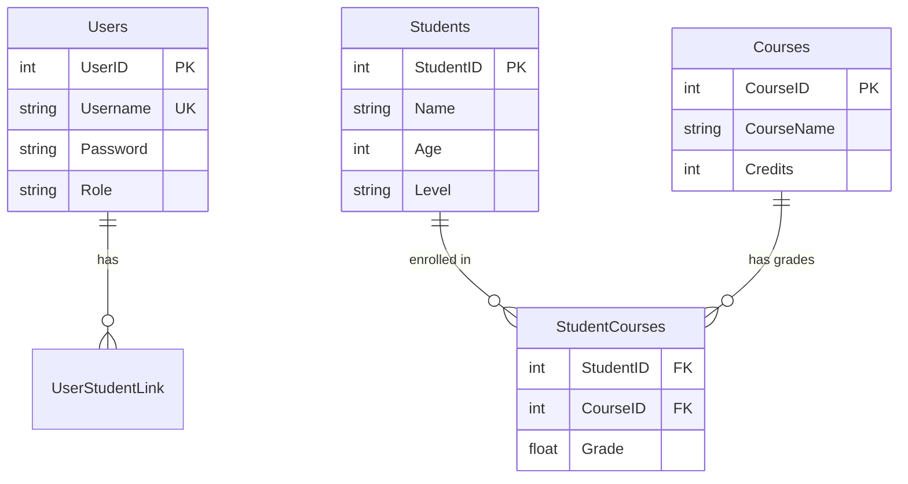
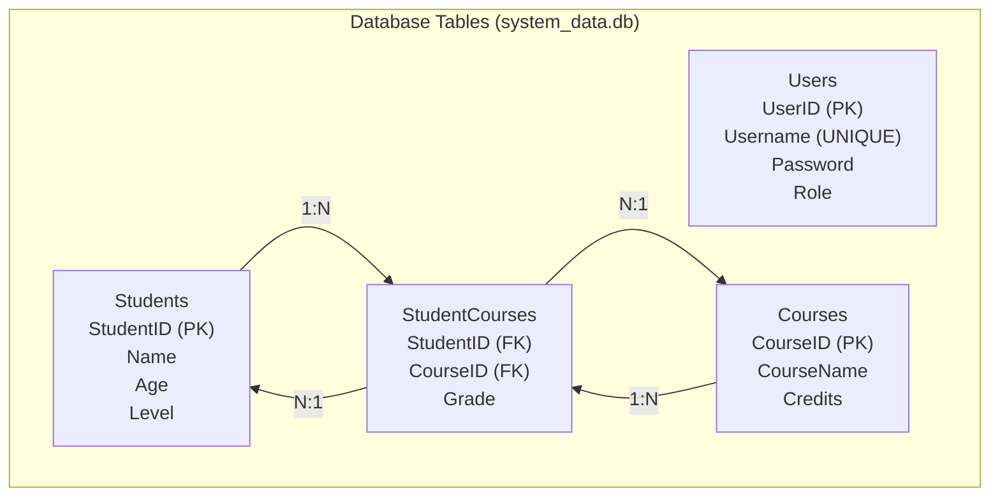
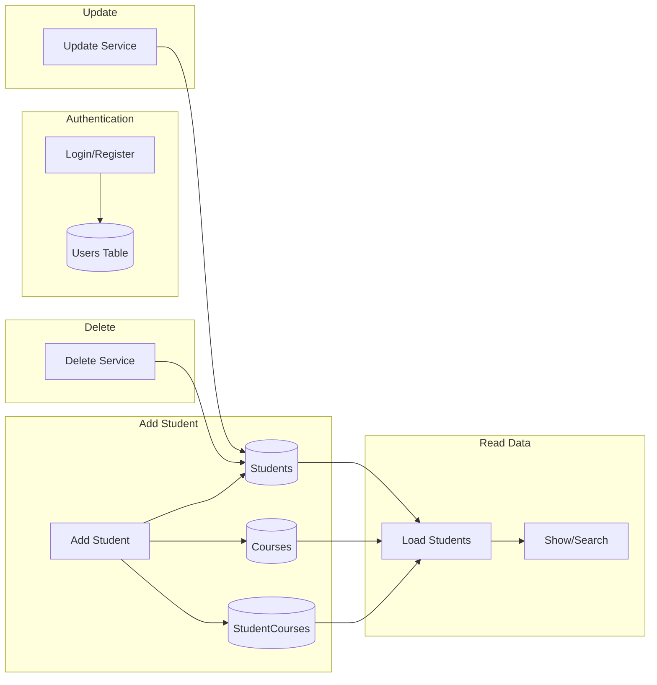
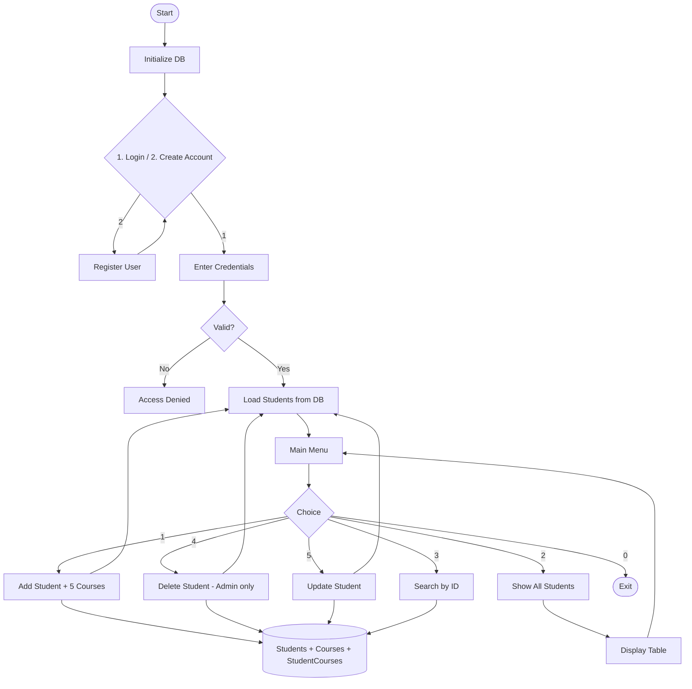

# Student Management System

A C++ console application for managing student records with SQLite database. Supports login, account creation, CRUD operations on students and courses, with role-based access (Admin/Staff).

## Features

### Authentication
- **Login** — Sign in with username and password
- **Create Account** — Register new users with role (Admin/Staff)
- **Role-based Access** — Admin can delete; Staff has limited permissions

### Student Management
- **Add Student & Courses** — Add students with up to 5 courses and grades
- **Show All Students** — Display students in formatted table with GPA and rating
- **Search Student** — Search by ID in database
- **Delete Student** — Remove student (Admin only)
- **Update Student** — Modify name and age

## Project Structure

```
StudentManagement/
├── main.cpp                    # Entry point
├── app.cpp                     # Main loop, menu, auth flow
├── models/
│   ├── header.h                # Main header (all dependencies)
│   └── studentes_model.h       # Student & Course structs
├── database/
│   ├── database.cpp/h          # DB initialization (create tables)
├── services/
│   ├── CRUD_service/
│   │   ├── add_servic.cpp/h       # Add student + courses
│   │   ├── show_servic.cpp/h      # Display students
│   │   ├── search_servic.cpp/h    # Search by ID
│   │   ├── delete_servic.cpp/h    # Delete student
│   │   ├── update_servic.cpp/h    # Update student
│   │   └── sort_servic.cpp/h      # Sort by ID
│   ├── saveing_service/
│   │   ├── saveing_service.cpp/h     # CSV import/export
│   │   ├── saving_in_database.cpp/h  # Save student to DB
│   │   ├── load_service.cpp         # Load students from DB
│   │   ├── update_servic.cpp        # Update student in DB
│   │   └── database_service.h       # load_students, update_student
│   ├── auth_service/
│   │   └── auth_service.cpp/h    # Login, register
│   └── GPA_service/
│       └── gpa_service.cpp/h     # GPA calculation, rating
├── sqlite3/
│   └── sqlite3.c/h              # SQLite
└── students_data.csv            # CSV backup
```

## Build & Run

### Compile (g++ / MinGW)

```bash
g++ main.cpp app.cpp database/database.cpp services/CRUD_service/*.cpp services/saveing_service/*.cpp services/auth_service/*.cpp services/GPA_service/*.cpp sqlite3/sqlite3.c -o student_app.exe -I.
```

### Run

```bash
./student_app.exe
```

On **Windows** (PowerShell/CMD):

```bash
.\student_app.exe
```

> Run from the project root directory.

## Database Schema & Flowchart

### Entity Relationship Diagram



### Database Tables Structure



### Data Flow — How the Database is Used



### Table Details

| Table | Column | Type | Description |
|-------|--------|------|-------------|
| **Users** | UserID | INTEGER PK | Auto-increment |
| | Username | TEXT UNIQUE | Login name |
| | Password | TEXT | Password |
| | Role | TEXT | Admin / Staff |
| **Students** | StudentID | INTEGER PK | Student ID |
| | Name | TEXT | Student name |
| | Age | INTEGER | Age |
| | Level | TEXT | Study level |
| **Courses** | CourseID | INTEGER PK | Auto-increment |
| | CourseName | TEXT | Course name |
| | Credits | INTEGER | Default 3 |
| **StudentCourses** | StudentID | INTEGER FK | → Students |
| | CourseID | INTEGER FK | → Courses |
| | Grade | REAL | Course grade |

## Application Flowchart



## Data Model (C++)

| Field | Type | Description |
|-------|------|-------------|
| `id` | int | Student ID |
| `name` | string | Student name |
| `age` | int | Age |
| `study_level` | string | Level (e.g. Bachelor, Master) |
| `course[5]` | course[] | Up to 5 courses |
| `gpa` | double | Calculated GPA |

### Course struct

| Field | Type |
|-------|------|
| `course_name` | string |
| `grade` | double |
| `credits` | int (default 3) |

## CSV Format

```
ID,Name,Age,Level
1,John Doe,20,Bachelor
2,Jane Smith,22,Master
```
