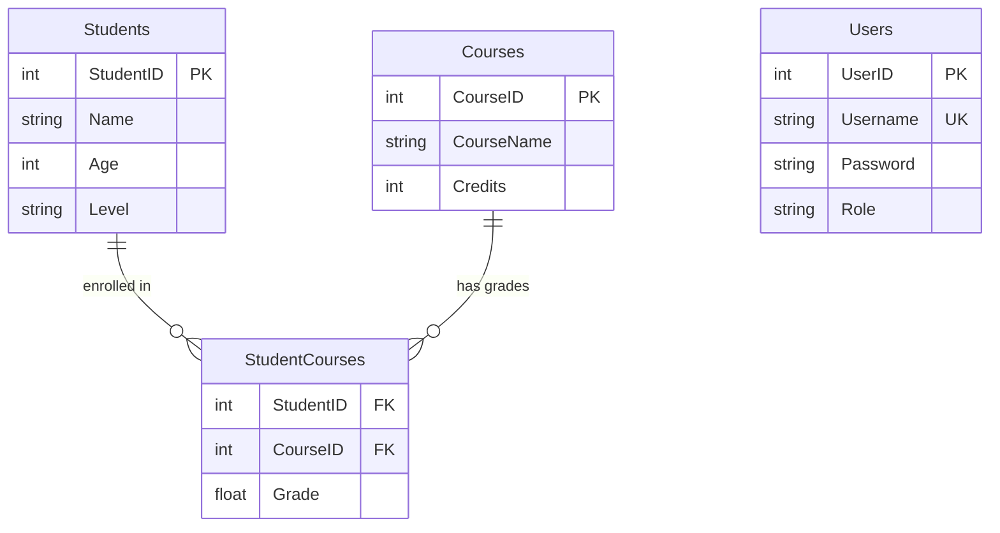
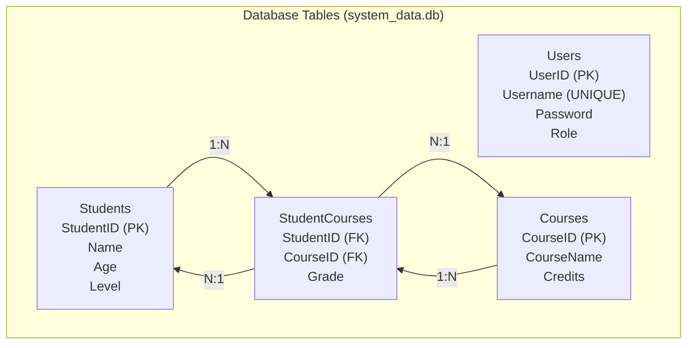
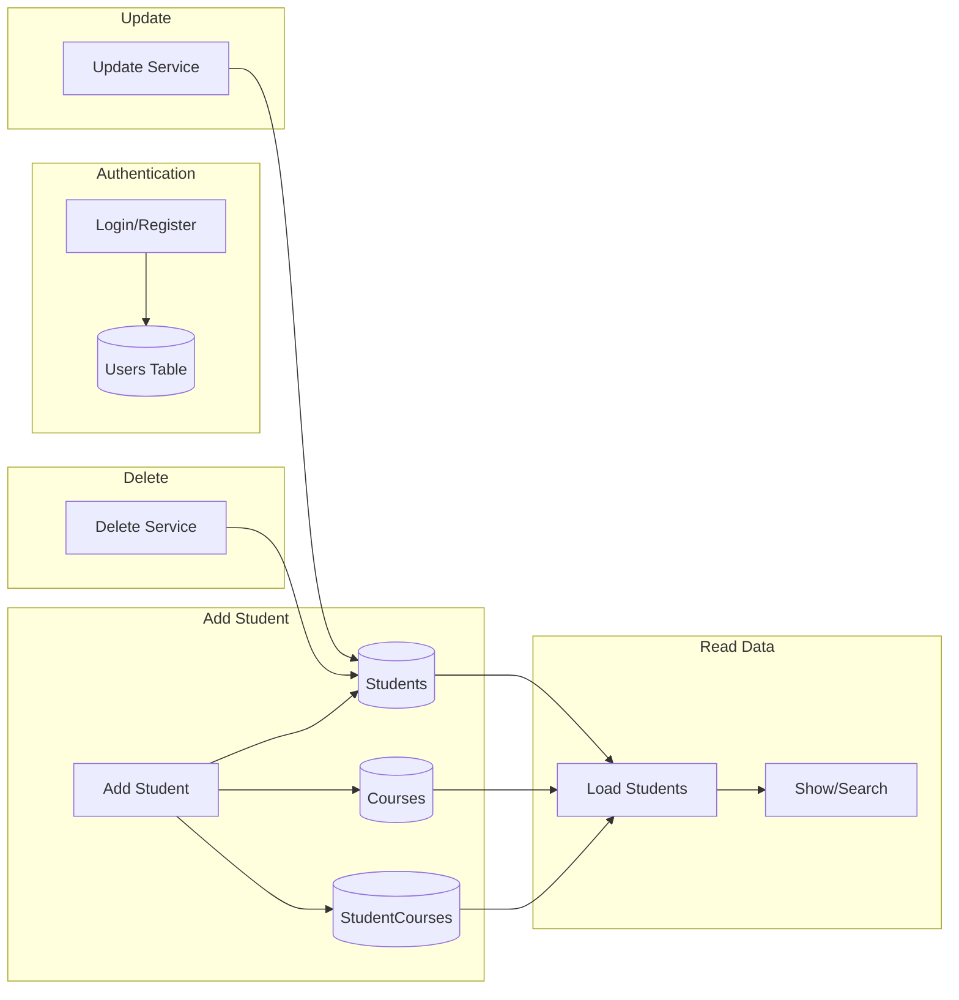

# Student Management System

A C++ console application for managing student records with SQLite database. Supports login, account creation, CRUD operations on students and courses, with role-based access (Admin/Staff).

---

## Table of Contents

1. [Overview](#overview)
2. [Features](#features)
3. [Architecture](#architecture)
4. [Project Structure](#project-structure)
5. [Detailed Module Explanation](#detailed-module-explanation)
6. [Build & Run](#build--run)
7. [Database Schema & Flowchart](#database-schema--flowchart)
8. [Application Flowchart](#application-flowchart)
9. [Data Models](#data-models)
10. [Usage Guide](#usage-guide)

---

## Overview

This project is a **Student Management System** built in C++ that:

- Uses **SQLite** (`system_data.db`) for persistent storage
- Implements **authentication** (login/register) with role-based access control
- Manages **students** and their **courses** (up to 5 per student) with grades
- Calculates **GPA** and displays **academic rating** (Excellent, Very Good, Good, Pass, Fail)
- Uses a **relational schema**: Users, Students, Courses, StudentCourses (junction table)

The application runs in the **console** and uses a menu-driven interface.

---

## Features

### Authentication
- **Login** — Sign in with username and password
- **Create Account** — Register new users with role (Admin/Staff)
- **Role-based Access** — Admin can delete; Staff has limited permissions

### Student Management
- **Add Student & Courses** — Add students with up to 5 courses and grades
- **Show All Students** — Display students in formatted table with GPA and rating
- **Search Student** — Search by ID in database
- **Delete Student** — Remove student (Admin only)
- **Update Student** — Modify name and age

---

## Architecture

```
┌─────────────────────────────────────────────────────────────────┐
│                         main.cpp                                 │
│                    (Entry: calls run())                          │
└────────────────────────────┬────────────────────────────────────┘
                             │
┌────────────────────────────▼────────────────────────────────────┐
│                         app.cpp                                  │
│  • initialize_db()                                               │
│  • Auth flow (Login / Create Account)                            │
│  • Main menu loop (CRUD operations)                              │
└────────────────────────────┬────────────────────────────────────┘
                             │
        ┌────────────────────┼────────────────────┐
        │                    │                    │
        ▼                    ▼                    ▼
┌───────────────┐   ┌────────────────┐   ┌──────────────────┐
│ auth_service  │   │ CRUD_service   │   │ saveing_service   │
│ • login       │   │ • add          │   │ • load from DB    │
│ • register    │   │ • show         │   │ • update in DB    │
└───────┬───────┘   │ • search       │   │ • CSV import/exp  │
        │           │ • delete       │   └─────────┬──────────┘
        │           │ • update      │             │
        │           │ • sort        │             │
        │           └───────┬───────┘             │
        │                   │                     │
        └───────────────────┼─────────────────────┘
                            │
                            ▼
                  ┌─────────────────────┐
                  │  system_data.db      │
                  │  (SQLite)            │
                  │  Users, Students,    │
                  │  Courses,            │
                  │  StudentCourses      │
                  └─────────────────────┘
```

**Layers:**
- **Presentation**: Console I/O in `app.cpp`
- **Business Logic**: Services (auth, CRUD, saveing, GPA)
- **Data Access**: SQLite via prepared statements
- **Models**: `Student`, `course` structs

---

## Project Structure

```
StudentManagement/
├── main.cpp                    # Entry point
├── app.cpp                     # Main loop, menu, auth flow
├── models/
│   ├── header.h                # Main header (all dependencies)
│   └── studentes_model.h       # Student & Course structs
├── database/
│   ├── database.cpp/h          # DB initialization (create tables)
├── services/
│   ├── CRUD_service/
│   │   ├── add_servic.cpp/h       # Add student + courses
│   │   ├── show_servic.cpp/h      # Display students
│   │   ├── search_servic.cpp/h    # Search by ID
│   │   ├── delete_servic.cpp/h    # Delete student
│   │   ├── update_servic.cpp/h    # Update student
│   │   └── sort_servic.cpp/h      # Sort by ID
│   ├── saveing_service/
│   │   ├── saveing_service.cpp/h     # CSV import/export
│   │   ├── saving_in_database.cpp/h  # Save student to DB
│   │   ├── load_service.cpp         # Load students from DB
│   │   ├── update_servic.cpp        # Update student in DB
│   │   └── database_service.h       # load_students, update_student
│   ├── auth_service/
│   │   └── auth_service.cpp/h    # Login, register
│   └── GPA_service/
│       └── gpa_service.cpp/h     # GPA calculation, rating
├── sqlite3/
│   └── sqlite3.c/h              # SQLite
└── students_data.csv            # CSV backup
```

---

## Detailed Module Explanation

### 1. Entry Point (`main.cpp`)

- Calls `run()` and exits.
- Minimal: delegates all logic to `app.cpp`.

---

### 2. Application Core (`app.cpp`)

**Flow:**
1. **Initialize DB** — `initialize_db()` creates tables if they don't exist.
2. **Auth Menu** — User chooses Login (1) or Create Account (2).
3. **Create Account** — Prompts for username, password, role (Admin/Staff); calls `register_user_db()`.
4. **Login** — Prompts for username/password; `check_login_from_db()` returns role or `"Invalid"`.
5. **Access Check** — If invalid, prints "Access Denied" and exits.
6. **Load Data** — `load_students_from_db(students)` loads all students with courses from DB.
7. **Main Loop** — Menu with options 1–5 and 0 (Exit).

**Menu Options:**
| Option | Action | Who Can Use |
|--------|--------|-------------|
| 1 | Add Student & Courses | All |
| 2 | Show All Students | All |
| 3 | Search Student (DB) | All |
| 4 | Delete Student | **Admin only** |
| 5 | Update Student Data | All |
| 0 | Exit | All |

---

### 3. Database (`database/`)

**`initialize_db()`** creates 4 tables in `system_data.db`:

| Table | Purpose |
|-------|---------|
| **Users** | User accounts (UserID, Username, Password, Role) |
| **Students** | Student records (StudentID, Name, Age, Level) |
| **Courses** | Course catalog (CourseID, CourseName, Credits) |
| **StudentCourses** | Links students to courses with Grade (many-to-many) |

Uses `CREATE TABLE IF NOT EXISTS` so it is safe to run multiple times.

---

### 4. Auth Service (`auth_service/`)

**`check_login_from_db(username, password)`**
- Runs: `SELECT ROLE FROM Users WHERE USERNAME = ? AND PASSWORD = ?`
- Returns role string (e.g. `"Admin"`, `"Staff"`) or `"Invalid"` if not found.

**`register_user_db(username, password, role)`**
- Runs: `INSERT INTO Users (USERNAME, PASSWORD, ROLE) VALUES (?, ?, ?)`
- Stores new user in DB.

---

### 5. CRUD Service (`CRUD_service/`)

**`add_Student(S, students)`**
1. Reads: ID, Name, Age, Level from user.
2. Inserts row into **Students**.
3. For each of 5 courses:
   - Reads course name and grade (0–100, validated).
   - Inserts/ignores into **Courses** (`INSERT OR IGNORE`).
   - Gets `CourseID` via `last_insert_rowid`.
   - Inserts into **StudentCourses** (StudentID, CourseID, Grade).

**`Show_Student_data(students)`**
- Prints table: ID, Name, Age, Level, 5 courses (name + grade), GPA, Rating.
- Uses `get_rating(gpa)` from GPA service for rating.

**`search_by_id(list)`** (in-memory)
- Binary search on sorted `vector<Student>` by ID.
- Uses `find_student_by_id()` for index.

**`search_by_id_from_db()`**
- Reads ID from user.
- Runs: `SELECT * FROM Students WHERE ID = ?` (note: column may be `StudentID` depending on schema).
- Loads courses from **StudentCourses** + **Courses**.
- Displays via `Show_one_Student_data()`.

**`delete_service(students)`**
- Admin only.
- Reads ID, finds in vector, deletes from DB and from `students` vector.
- Uses `system.db` (possible inconsistency with `system_data.db`).

**`sort_Students_by_id(students)`**
- Bubble sort by `id` (used when working with in-memory list).

**`find_student_by_id(list, search_id)`**
- Binary search on sorted list; returns index or -1.

---

### 6. Saveing Service (`saveing_service/`)

**`load_students_from_db(list)`**
1. Clears `list`.
2. Runs: `SELECT * FROM Students ORDER BY StudentID ASC`.
3. For each student:
   - Runs: `SELECT C.CourseName, SC.Grade, C.Credits FROM StudentCourses SC JOIN Courses C ON SC.CourseID = C.CourseID WHERE SC.StudentID = ?`.
   - Fills `course[0..4]` and computes GPA: `(grade * credits) / total_credits`.
4. Pushes student into `list`.

**`update_student_db_service(students)`**
1. Reads student ID.
2. Finds in `students` via `find_student_by_id()`.
3. Reads new name and age.
4. Runs: `UPDATE Students SET Name = ?, Age = ? WHERE StudentID = ?`.
5. Updates in-memory `students` and prints success.

**`save_student_to_db(S)`** (in `saving_in_database.cpp`)
- Used by older flow; inserts into `system.db` with 15 columns (different schema).
- May not be used by current `add_Student` which writes directly to `system_data.db`.

**`export_to_csv(students)` / `import_from_csv(students)`**
- Export: writes `ID,Name,Age,Level` to `students_data.csv`.
- Import: reads CSV and appends to `students` (no courses).

---

### 7. GPA Service (`GPA_service/`)

**`get_grade_points(grade)`** — Maps percentage to 4.0 scale:

| Grade (0-100) | Points |
|---------------|--------|
| 90+ | 4.0 |
| 85-89 | 3.7 |
| 80-84 | 3.3 |
| 75-79 | 3.0 |
| 70-74 | 2.7 |
| 65-69 | 2.4 |
| 60-64 | 2.0 |
| 50-59 | 1.0 |
| &lt;50 | 0.0 |

**`get_rating(gpa)`** — Maps GPA to text:

| GPA | Rating |
|-----|--------|
| ≥3.7 | Excellent (A) |
| ≥3.0 | Very Good (B) |
| ≥2.0 | Good (C) |
| ≥1.0 | Pass (D) |
| &lt;1.0 | Fail (F) |

**`calculate_and_assign_gpa(S)`**
- Computes: `Σ(grade_points × credits) / total_credits`.
- Assigns to `S.gpa` and prints result.

---

### 8. Models (`models/`)

**`studentes_model.h`**
- **`Student`**: id, name, study_level, age, course[5], gpa
- **`course`**: course_name, grade, credits (default 3)

**`header.h`**
- Includes standard libs, models, sqlite3, all service headers, database.h

---

## Build & Run

### Compile (g++ / MinGW)

```bash
g++ main.cpp app.cpp database/database.cpp services/CRUD_service/*.cpp services/saveing_service/*.cpp services/auth_service/*.cpp services/GPA_service/*.cpp sqlite3/sqlite3.c -o student_app.exe -I.
```

### Run

```bash
./student_app.exe
```

On **Windows** (PowerShell/CMD):

```bash
.\student_app.exe
```

> Run from the project root directory.

## Database Schema & Flowchart

### Entity Relationship Diagram



### Database Tables Structure



### Data Flow — How the Database is Used



### Table Details

| Table | Column | Type | Description |
|-------|--------|------|-------------|
| **Users** | UserID | INTEGER PK | Auto-increment |
| | Username | TEXT UNIQUE | Login name |
| | Password | TEXT | Password |
| | Role | TEXT | Admin / Staff |
| **Students** | StudentID | INTEGER PK | Student ID |
| | Name | TEXT | Student name |
| | Age | INTEGER | Age |
| | Level | TEXT | Study level |
| **Courses** | CourseID | INTEGER PK | Auto-increment |
| | CourseName | TEXT | Course name |
| | Credits | INTEGER | Default 3 |
| **StudentCourses** | StudentID | INTEGER FK | → Students |
| | CourseID | INTEGER FK | → Courses |
| | Grade | REAL | Course grade |

## Application Flowchart


## Data Model (C++)

| Field | Type | Description |
|-------|------|-------------|
| `id` | int | Student ID |
| `name` | string | Student name |
| `age` | int | Age |
| `study_level` | string | Level (e.g. Bachelor, Master) |
| `course[5]` | course[] | Up to 5 courses |
| `gpa` | double | Calculated GPA |

### Course struct

| Field | Type |
|-------|------|
| `course_name` | string |
| `grade` | double |
| `credits` | int (default 3) |

## CSV Format

```
ID,Name,Age,Level
1,John Doe,20,Bachelor
2,Jane Smith,22,Master
```

---

## Usage Guide

### First Run

1. **Compile** the project (see [Build & Run](#build--run)).
2. **Run** the executable.
3. **Create Account** (option 2): enter username, password, role (`Admin` or `Staff`).
4. **Login** (option 1): enter the same username and password.

### Adding a Student

1. Choose **1. Add Student & Courses**.
2. Enter: **ID**, **Name**, **Age**, **Level**.
3. For each of 5 courses: enter **Course Name** and **Grade** (0–100).
4. Data is saved to `system_data.db` (Students, Courses, StudentCourses).

### Viewing Students

- **2. Show All Students** — Lists all students with courses, GPA, and rating.
- **3. Search Student (DB)** — Enter student ID to view one student.

### Updating a Student

1. Choose **5. Update Student Data**.
2. Enter the student ID.
3. Enter new **Name** and **Age**.
4. Both DB and in-memory list are updated.

### Deleting a Student

- **Admin only.** Choose **4. Delete Student**, enter ID.
- Student is removed from DB and from the in-memory list.

### Roles

| Role | Permissions |
|------|-------------|
| **Admin** | Add, Show, Search, **Delete**, Update |
| **Staff** | Add, Show, Search, Update (no Delete) |

---

## Dependencies

- **C++ compiler** (g++, MinGW, clang, or MSVC)
- **SQLite** (included as `sqlite3.c` amalgamation)
- **Standard library**: `<string>`, `<iostream>`, `<vector>`, `<iomanip>`, `<fstream>`, `<sstream>`

---

## File Locations

| File | Purpose |
|------|---------|
| `system_data.db` | Main SQLite database (created on first run) |
| `students_data.csv` | CSV backup (used by saveing_service if integrated) |

---

## Quick Reference

| Task | Service | Key Function |
|------|---------|--------------|
| Login | auth_service | `check_login_from_db()` |
| Register | auth_service | `register_user_db()` |
| Add student | CRUD/add_servic | `add_Student()` |
| Show all | CRUD/show_servic | `Show_Student_data()` |
| Search | CRUD/search_servic | `search_by_id_from_db()` |
| Delete | CRUD/delete_servic | `delete_service()` |
| Update | saveing/update_servic | `update_student_db_service()` |
| Load from DB | saveing/load_service | `load_students_from_db()` |
| GPA/Rating | GPA_service | `get_rating()`, `get_grade_points()` |

---

## Author

Ahmed Wageeh Mohamed — 20230075
