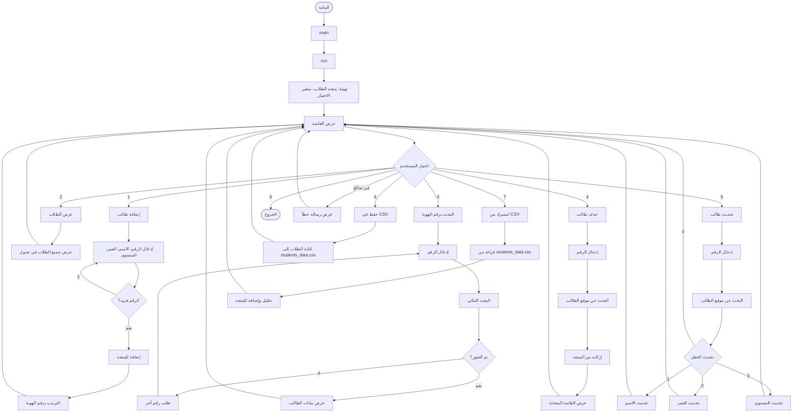
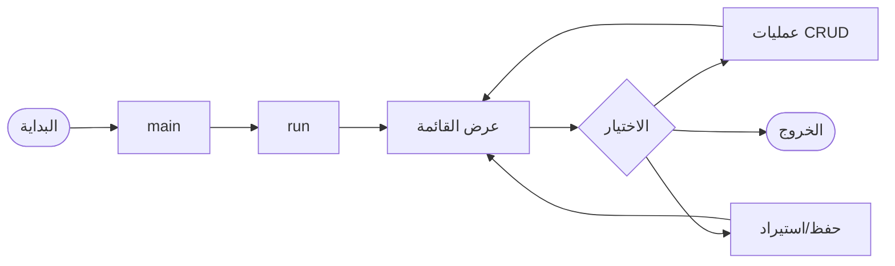

# نظام إدارة الطلاب

تطبيق C++ يعمل من خلال واجهة الأوامر لإدارة سجلات الطلاب. يدعم إضافة وعرض وبحث وتحديث وحذف الطلاب، مع حفظ البيانات في ملفات CSV.

## المميزات

- **إضافة طالب** — إضافة طلاب جدد برقم هوية فريد، الاسم، العمر، والمستوى الدراسي
- **عرض الطلاب** — عرض جميع الطلاب في جدول منسق
- **بحث عن طالب** — البحث عن طالب برقم الهوية باستخدام البحث الثنائي
- **حذف طالب** — إزالة طالب برقم الهوية
- **تحديث طالب** — تعديل الاسم أو العمر أو المستوى الدراسي لطالب موجود
- **حفظ البيانات** — تصدير جميع الطلاب إلى ملف `students_data.csv`
- **استيراد البيانات** — تحميل الطلاب من ملف `students_data.csv`

## هيكل المشروع

```
StudentManagement/
├── main.cpp                 # نقطة البداية
├── app.cpp                  # الحلقة الرئيسية والقائمة
├── models/
│   ├── header.h             # الهيدر الرئيسي (يضم كل التبعيات)
│   └── studentes_model.h    # هياكل بيانات الطالب والمقرر
├── services/
│   ├── CRUD_service/
│   │   ├── add_servic.cpp/h     # إضافة طالب
│   │   ├── show_servic.cpp/h    # عرض الطلاب
│   │   ├── search_servic.cpp/h  # البحث برقم الهوية
│   │   ├── delete_servic.cpp/h  # حذف طالب
│   │   ├── update_servic.cpp/h  # تحديث طالب
│   │   └── sort_servic.cpp/h    # الترتيب برقم الهوية
│   └── saveing_service/
│       └── saveing_service.cpp/h  # استيراد/تصدير CSV
└── students_data.csv        # ملف تخزين البيانات
```

## طريقة البناء والتشغيل

### التجميع (Compile)

**باستخدام g++ (MinGW / Linux / WSL):**

```bash
g++ main.cpp app.cpp services/CRUD_service/add_servic.cpp services/CRUD_service/show_servic.cpp services/CRUD_service/search_servic.cpp services/CRUD_service/delete_servic.cpp services/CRUD_service/update_servic.cpp services/CRUD_service/sort_servic.cpp services/saveing_service/saveing_service.cpp -o StudentManagement
```

### التشغيل (Run)

```bash
./StudentManagement
```

على **Windows** (PowerShell أو CMD):

```bash
.\StudentManagement.exe
```

> **ملاحظة:** نفّذ أوامر التجميع والتشغيل من مجلد المشروع `StudentManagement`.

## مخطط الانسياب — كيف يعمل التطبيق



## التدفق الرئيسي المبسط



## نموذج البيانات

| الحقل       | النوع   | الوصف    |
|------------|--------|----------|
| `id`       | int    | رقم هوية الطالب الفريد |
| `name`     | string | اسم الطالب   |
| `age`      | int    | عمر الطالب    |
| `study_level` | string | المستوى الدراسي (مثل بكالوريوس، ماجستير) |

## تنسيق ملف CSV

يستخدم ملف `students_data.csv` التنسيق التالي:

```
ID,Name,Age,Level
1,أحمد محمد,20,بكالوريوس
2,فاطمة علي,22,ماجستير
```
